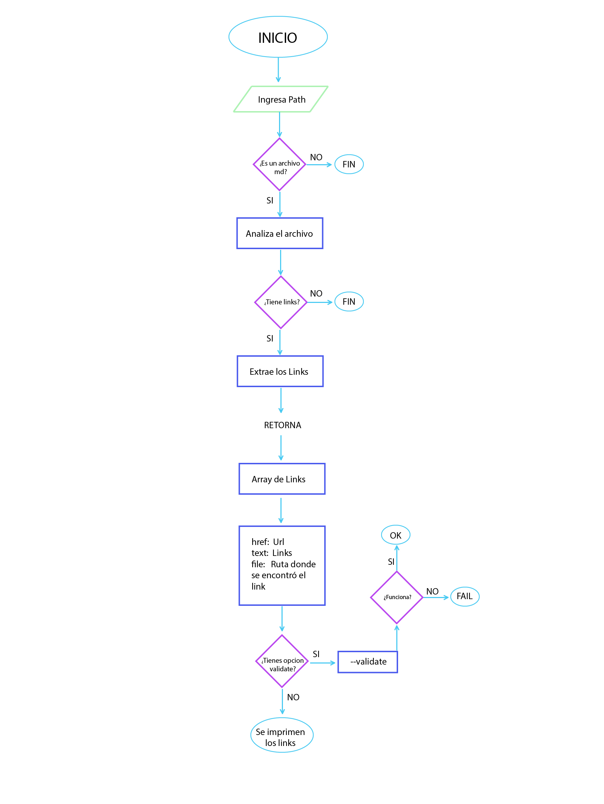

## 1. Preámbulo

[Markdown](https://es.wikipedia.org/wiki/Markdown) es un lenguaje de marcado
ligero muy popular entre developers. Es usado en muchísimas plataformas que
manejan texto plano (GitHub, foros, blogs, ...), y es muy común
encontrar varios archivos en ese formato en cualquier tipo de repositorio
(empezando por el tradicional `README.md`).

Estos archivos `Markdown` normalmente contienen _links_ (vínculos/ligas) que
muchas veces están rotos o ya no son válidos y eso perjudica mucho el valor de
la información que se quiere compartir.

Dentro de una comunidad de código abierto, nos han propuesto crear una
herramienta usando [Node.js](https://nodejs.org/), que lea y analice archivos
en formato `Markdown`, para verificar los links que contengan y reportar
algunas estadísticas.

## 2. Diagrama de Flujo

## 3. Documentación técnica de la librería

Las herramientas y dependencias implementadas para la construcción de esta Librería fueron las siguientes:

Especificaciones técnicas
## Lenguaje
JavaScript 

## Ejecución
Node.js

## Dependencias y modulos NPM

Path
File System
markdown-link-extractor
marked
url-status-code
chalk
node-fetch
module.exports

## PROXIMAS ITERACIONES

En próximas iteraciones se agregara las opciones de --validate y --stats y estadisticas, asi como tambien la creacion de la libreria instalable, pasos para la ## Instalación de la librería y ## Guía de Uso.
(
## Instalación de la librería
## Guía de Uso
)

## Autor
Nerymar Guarnizo Carvajal

